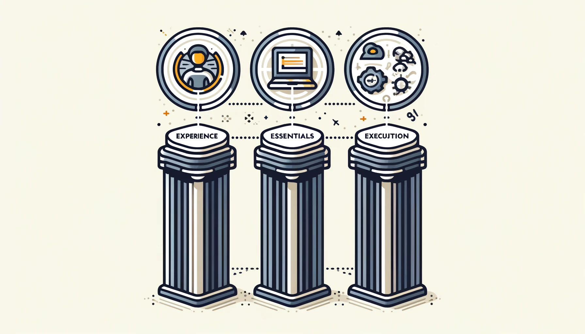
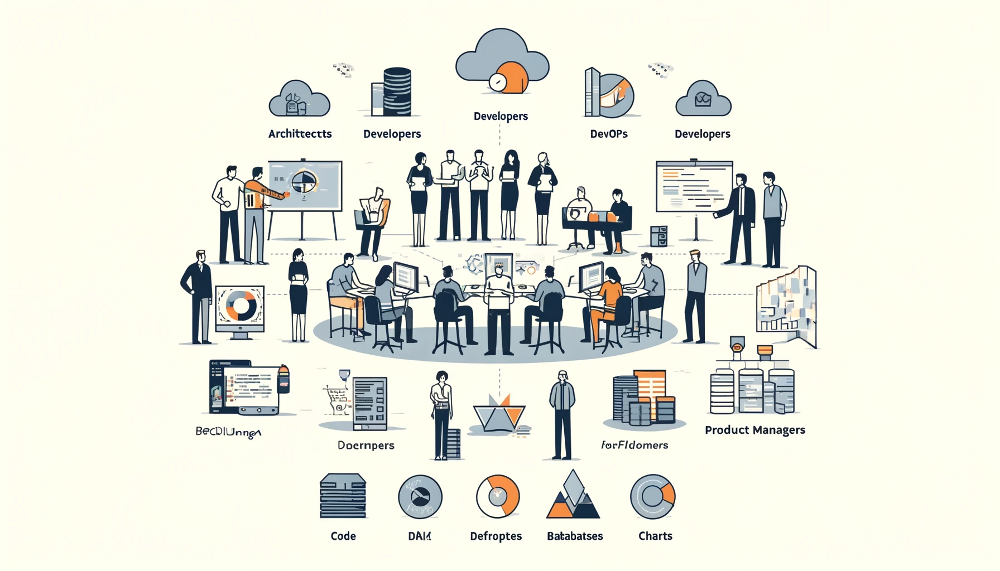
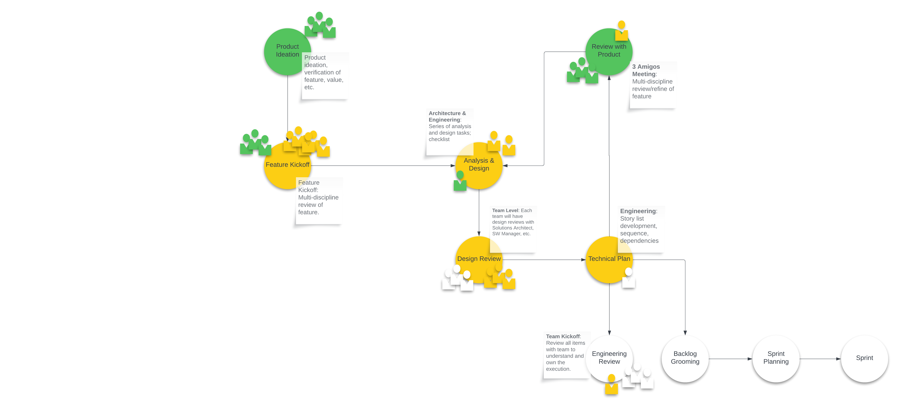
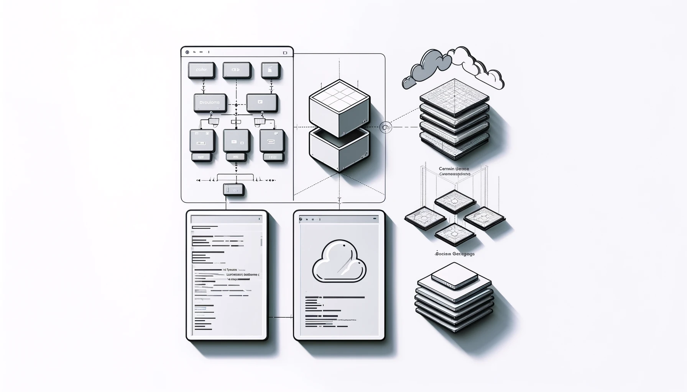

<!-- Welcome and Introduction -->
   
# The Architect's Blueprint
   
## Building Scalable and Maintainable Web Applications

<!-- Speaker note: 
Start with a personal story a challenging project. Set the stage for why scalable and maintainable architecture is crucial.

- The technology stack does not matter – you can write a good or a bad application in any technology stack!
- Financial Tech, Medical, Messaging Platforms, Medical Device, Travel, Attendee Registration, Destination Travel, Ad Platform, Payment Systems, etc.

- Why do you want to build a scalable and maintainable web application?
- What are the challenges you face in your current projects?
- Can you overcome these challenges with the right architecture?
-->

---

## **About Me**

- Matt Vaughn, Application & Solutions Architect
- [AngularArchitecture.com](https://angulararchitecture.com)
- [GitHub: buildmotion](https://github.com/buildmotion)
- [X: @AngularArch](https://twitter.com/AngularArch)
- Presentation: [https://bit.ly/monorepos-unleashed](https://bit.ly/monorepos-unleashed)

---

# Overview of the Session

   - Designing an Architecture
   - Tools and Automation
   - Leveraging Frameworks
   - Advanced Code Generation Techniques
   - Applying SOLID Principles
   - Packages and Frameworks Overview

<!-- 
Speaker note: Briefly outline the main points of the session. Emphasize the journey from initial challenges to mastering scalable architecture. 

“The plan is to go in there and win; everybody has a plan until they get hit. Then, like a rat, they stop in fear and freeze.”

-->

---

# Plan?

<!-- Notes:
Mike Tyson first mentioned this quote before his 1987 fight against Tyrell Biggs. The context was in response to a reporter’s question about whether he was worried about his opponents’ strategies.. – Mike Tyson -->

---

# Plan

> “The plan is to go in there and win; everybody has a plan until they get hit. Then, like a rat, they stop in fear and freeze.”

<!-- Notes:
Mike Tyson first mentioned this quote before his 1987 fight against Tyrell Biggs. The context was in response to a reporter’s question about whether he was worried about his opponents’ strategies.. – Mike Tyson -->

---

# The Elements of Architecture

1. Experience
2. Essentials
3. Execution

---

## Experience

   - Specific knowledge of business, domain, and customers
   - Defines the W's: what, who, when, where, and why?
   - Involves architects, developers, DevOps, DBAs, Product, SMEs

<!-- Speaker note: 
Share a story about understanding a client's business deeply and how it influenced the architectural decisions.

1. ad platform. Distribute custom data profiles.
2. medical messaging platform: user simplicity, abstract the complexity
3. BBQ's and weddings.
-->

---

### Experience :: Communication Workflow

<!-- Speaker note:
- The communication workflow between product and development teams is crucial for understanding user needs and translating them into technical requirements.
- The product team defines the "what" and "why," while the development team focuses on the "how."
  - Perform exercises that help explain the workflow; requirements gathering, user stories, etc.
  - UML diagrams, wireframes, and mockups, etc.
  - Domain storytelling
  - Use cases and workflows
  - Class/sequence diagrams
--> 

---

### Analysis and Design

- actors and personas (who)
- use cases and/or workflows
  - simple, detailed
- domain storytelling

<!--
Analysis: This is the process of understanding the problem that needs to be solved. It involves gathering requirements, understanding user needs, and defining the scope of the problem.

Software Architecture: This refers to the high-level structure of a software system. It’s the blueprint for both the system and the project developing it. It defines the work assignments that must be carried out by design and implementation teams. The architecture is the primary carrier of system qualities such as performance, modifiability, and security, none of which can be achieved without a unifying architectural vision.-->

---

### Design

<!-- Prompt for graphic: A minimalist graphic featuring a C4 model diagram alongside UI mockups and domain models (class/sequence diagrams), showing the process of moving from high-level architecture to detailed design. -->

--- 

### Design - How?

- C4, 4+1 Models
- UI mockup (low/high Fidelity)
- Domain modeling
  - Class/sequence diagrams
- Sequence; order of operation

<!--
Design: Once the problem is well-understood, software design involves planning how to solve it. This includes deciding on the software’s structure, identifying key components, and outlining how they will interact.
-->

---

## Essentials
<!-- Prompt for graphic: An image showing various development tools and materials, represented by icons (e.g., a toolbox, servers for hosting environments, and CI/CD pipelines), emphasizing their roles in the development process. -->

- Tools and Materials
- Hosting Environments
- CI/CD Automation

<!-- 
Speaker note: 
Discuss the importance of choosing the right tools and environments, likening it to selecting materials for a building. 

- support requirements
- Understanding and know capabilities
- Within budget
- available and reliable
- Support and documentation, training
- purchase versus build
-->

---

## Execution

   - Development workflow and developer experience
   - Ensuring code quality and reliability
   - Continuous evaluation and discipline

<!-- Speaker note: 
Use a construction analogy to highlight the importance of disciplined execution and continuous monitoring.

- monitor the execution
- Standards and compliance
- reviews and Playbooks
-->

---

<!-- Section 1: Designing a CLEAN Architecture 
-->

# Designing an Architecture

> “Software architecture is the high-level structure of a software system, defining its parts, their interactions, and the guiding principles and patterns for design and evolution.”

- Definition and Principles
- Benefits
- Case Study
- Best Practices
   
<!-- Speaker note: 
Introduce architecture with a story about a project transformation. Highlight the benefits using real-world examples.

“Software architecture is the high-level structure of a software system, defining its components, their interactions, and the guiding principles and patterns for design and evolution.”

- foundation, design, patterns, structural, functional
- feature verticals
  - Granularity
– horizontal layers
  - communication boundaries.
  - abstractions and adapters
– crosscutting concerns (e.g. security, logging, error handling, etc.)
– code organization
- sharing/reusing code
-->

---

## Definition and Principles of CLEAN Architecture

   - Separation of Concerns
   - Dependency Rule
   - Entities, Use Cases, Interfaces, and Frameworks

<!-- Speaker note: 
Use an analogy like building a house to explain the layers and dependencies. -->

---

### Separation of Concerns

- Features (Vertical/Horizontal):
  - UI/UX
  - business logic
  - Data access or API access
- How?: code organization...

<!-- Notes:
Separation of Concerns (SoC) is a design principle for separating a computer program into distinct sections, such that each section addresses a separate concern. Here are some talking points related to SoC in the context of software architecture:

Definition of SoC: Explain what Separation of Concerns is, highlighting that it’s a design principle aimed at organizing code in a way that each part addresses a separate concern or functionality.

Importance of SoC: Discuss the benefits of SoC, like easier code management, enhanced readability, simpler debugging, and improved development speed by allowing parallel work on individual concerns.

Levels of SoC: Talk about different levels where SoC can be applied, from high-level architectural patterns (like Model-View-Controller) to low-level code organization (like functions or methods).

SoC in Software Architecture: Detail how SoC plays out in different architectural styles. For instance, in microservices architecture, each service handles a separate concern.

SoC and Testing: Discuss how SoC aids in unit testing as each concern can be tested independently.

SoC and Maintenance: Highlight how a well-implemented SoC makes maintenance easier because changes in one section of the code are less likely to impact others.

Practical Examples: Give real-world examples of SoC in popular frameworks and libraries, like the separation of routes, controllers, and views in MVC frameworks.

Challenges of SoC: Discuss potential challenges in applying SoC, like identifying what constitutes a “concern” and the potential for over-engineering if taken to extremes.

SoC vs. Modularity: Explain the difference between SoC and modularity. While they are related concepts, they are not the same. SoC is about dividing the application into distinct features, whereas modularity is about encapsulating code into independent interchangeable modules.

Future of SoC: Discuss how modern trends, like cloud computing and serverless architecture, are influencing the application of SoC.
-->

---

<!--   //TODO: Add section for features -->

<!--   //TODO: Add section for horizontal layers -->

<!--   //TODO: Add section for crosscutting concerns, -->

### Dependency Rule

- IoC/dependency injection
- Providers and interfaces
- side effects
  - testing maintenance, extensibility, abstraction

<!--
In Clean Architecture, Robert C. Martin (often known as Uncle Bob) defines the Dependency Rule as follows:

Source code dependencies can only point inwards. Meaning, the outer levels are made up of mechanisms, and the inner levels are made up of policies (high-level business rules).

The further in you go, the higher level the software becomes. This means that the inner circles are the most general (high-level principles that are likely to remain stable as the system evolves) and the outer circles are more specific (implementation details that are likely to change frequently).

Nothing in an inner circle can know anything at all about something in an outer circle. In particular, the name of something declared in an outer circle must not be mentioned by the code in the inner circle. The inner circle should not have knowledge of anything in the outer circle.

The entities (the highest level policies) do not depend on anything else. They are at the center of the architecture.

The Dependency Rule is a key aspect of the Clean Architecture that helps to keep the system decoupled and thus easier to manage, understand, and develop.
-->

---

## Benefits of CLEAN Architecture

   - Enhanced Maintainability
   - Scalability
   - Improved Testability
   - Flexibility
   
<!-- Speaker note: 
Relate the benefits to common project pain points, like managing large codebases. 
- single or multiple team
- Monorepo, division of work
-->

---

## Case Study: Implementation in a Real-World Project

- Initial State vs. Post-Implementation
- Key Changes and Their Impact
   
<!-- Speaker note: Share specific metrics or outcomes from the case study to emphasize the transformation. 

Outcomes:
- rapid development; focus on features
- consistent and reliability
- High-quality; easy to test
- Patterns
- Code generation and scaffolding

Areas to improve:
- Technical documentation with diagrams
- More generators and automation
-->

---

## Best Practices for Maintaining CLEAN Architecture

- Regular Refactoring
- Code Reviews, Frequent Commits/Pushes
- Documentation, training, playbook
- mentality/accountability

<!-- Speaker note: Encourage the audience to adopt a culture of continuous improvement. -->

---

<!-- Section 2: Tools and Automation for Streamlining Development -->

# Tools and Automation for Streamlining Development

- Importance of Automation
- Tools for Enforcing Coding Standards
- CI/CD
- Automated Testing Frameworks
<!-- Speaker note: Frame this section as the toolkit for developers, likening it to a craftsman's essential tools. -->

---

   ## Importance of Automation in Development
   - Consistency
   - Efficiency
   - Error Reduction

<!-- Speaker note: Use a story about a project with manual processes and the dramatic improvement after automation. -->

---

## Tools for Enforcing Coding Standards

- Soell Chickeng
- ESLint. Prettier
- Code Access

<!-- Speaker note: 
Demonstrate how these tools can prevent common pitfalls and enhance code quality. 
-->

---

## Continuous Integration and Continuous Deployment (CI/CD)
   - GitHub Actions
   - Jenkins

<!-- Speaker note: Share a success story of a project turnaround with CI/CD implementation. -->

---

## Automated Testing Frameworks

- Unit/specification
- End to end testing
- Integration testing

<!-- Speaker note: Highlight Jest's capabilities with examples and emphasize its role in maintaining high-quality code. -->

---

<!-- Section 3: Leveraging Frameworks for Robust Systems -->

# Leveraging Frameworks for Robust Systems

- Front-End Frameworks
- Back-End Frameworks
- Seamless Communication
- UI Control Suites
- Logging and Monitoring Tools
- Performance and Analytical Tools
- Profiling Tools
- Quality and Reliability Strategy

<!-- Speaker note: Introduce this section by discussing the importance of choosing the right tools and frameworks, likening it to selecting the right materials for a building. -->

---

## Front-End Frameworks: Angular, React, Vue.js

   - Key Features and Use Cases
   - Performance Optimization Techniques
   <!-- Speaker note: Compare these frameworks with relatable metaphors, such as cars with different features and performance characteristics. -->

---

   ## Back-End Frameworks: NestJS, Express.js
   - Microservices Architecture
   - API Design and Management

<!-- Speaker note: Discuss the evolution from monolithic to microservices architecture, using historical project examples. -->

---

## Seamless Communication between Front-End and Back-End

- API response schema
- RESTful APIs vs. GraphQL

<!--
//TODO: Show example of APA response

Speaker note: Explain the pros and cons of each approach with anecdotes from real projects. 
-->

---

## Selection of UI Control Suites

   - Kendo UI
   - DevExtreme
   - PrimeNG

<!-- Speaker note: Discuss the importance of choosing the right UI controls for user experience and development efficiency. -->

---

## Logging and Monitoring Tools

- DataDog, New Relic
- Azure Application Insights

<!-- Speaker note: Share a story about a major issue detected and resolved through effective logging and monitoring. 
-->

---

## Performance and Analytical Tools
 
- Lighthouse
- WebPageTest

<!-- Speaker note: Emphasize the importance of performance metrics using a success story where these tools made a significant impact. -->

---

## Profiling Tools 

   - Chrome DevTools
   - Angular Profiler
   - React Profiler

<!-- Speaker note: Demonstrate how profiling tools can uncover hidden performance issues, improving the user experience. -->

---

## Quality and Reliability Strategy
   - Using Jest for Specification Tests
   - Strategy for Ensuring Quality and Reliability
   <!-- Speaker note: Outline a quality strategy using Jest, integrating it into the development process for consistent and reliable results. -->

---

<!-- Section 4: Advanced Code Generation Techniques -->

# Advanced Code Generation Techniques

- Introduction to Code Generation
- Tools for Code Generation: Nx, Yeoman
- Automating Boilerplate Code Production
- Examples and Demonstrations
<!-- Speaker note: Introduce this section with a story about how code generation can save time and reduce errors, transforming development workflows. -->

---

## Introduction to Code Generation
   - Benefits
   - Common Use Cases

<!-- Speaker note: Explain how code generation acts as a productivity multiplier, similar to using power tools in construction. -->

---

## Tools for Code Generation: Nx, Yeoman
   - Key Features and Capabilities

<!-- Speaker note: Highlight the strengths of these tools with specific examples and use cases. -->

---

## Automating Boilerplate Code Production

   - Examples
   - Best Practices

<!-- Speaker note: Show real-world examples of generated code and how it accelerates development. -->

---

## Examples and Demonstrations

   - Creating Custom Nx Plugins
   - Generating Angular Components and Services

<!-- Speaker note: Provide live coding demonstrations or pre-recorded demos to illustrate the process and benefits. -->

---

<!-- Section 5: Applying SOLID Principles in Front-End Development -->

# Applying SOLID Principles in Front-End Development

- Overview of SOLID Principles
- Practical Examples in Angular
- Angular Dependency Injection and IoC
- Benefits of SOLID

<!-- Speaker note: Introduce SOLID principles with a narrative on the evolution of programming practices, emphasizing their importance in modern development. -->

---

## Overview of SOLID Principles

   - Single Responsibility Principle (SRP)
   - Open/Closed Principle (OCP)
   - Liskov Substitution Principle (LSP)
   - Interface Segregation Principle (ISP)
   - Dependency Inversion Principle (DIP)

<!-- Speaker note: Use analogies like a well-organized kitchen to explain each principle in a relatable way. -->

---

## Practical Examples in Angular

   - Modular Architecture
   - Service-Oriented Design

<!-- Speaker note: Provide code examples to demonstrate the application of SOLID principles in Angular projects. -->

---

## Angular Dependency Injection

- Explanation of Dependency Injection (DI)
- How DI in Angular Relates to Inversion of Control (IoC)
- Practical Examples of DI in Angular

<!-- Speaker note: 
Explain DI with an analogy like hiring specialized contractors for different tasks, emphasizing the IoC pattern. 
-->

---

## Benefits of SOLID in Long-Term Maintenance and Scalability

- Improved Code Quality
- Easier Refactoring
- Enhanced Collaboration

<!-- Speaker note: 
Wrap up with a story about the long-term benefits of adhering to SOLID principles in large projects. 
-->

---

<!-- Section 6: Packages and Frameworks Overview -->

# Packages and Frameworks Overview

- Front-End Frameworks
- Back-End Frameworks
- UI Control Suites
- Logging and Monitoring Tools
- Performance and Analytical Tools
- Profiling Tools

<!-- Speaker note: Introduce this section as a comprehensive guide to the essential tools and frameworks, comparing it to a toolbox for developers. -->

---

## Front-End Frameworks

### Angular
   - Strengths: Strong typing, built-in RxJS support, CLI tools
   - Alternatives: [React](https://reactjs.org/), [Vue.js](https://vuejs.org/)
   <!-- Speaker note: Discuss Angular's strengths with examples and provide links to alternatives for further exploration. -->

### React
   - Strengths: Flexibility, large ecosystem, JSX
   - Alternatives: [Angular](https://angular.io/), [Svelte](https://svelte.dev/)
   <!-- Speaker note: Highlight React's strengths and point to alternative frameworks for comparison. -->

### Vue.js
   - Strengths: Easy to learn, flexible, performant
   - Alternatives: [React](https://reactjs.org/), [Svelte](https://svelte.dev/)
   <!-- Speaker note: Emphasize Vue.js's ease of use and link to other frameworks. -->

---

## Back-End Frameworks

### NestJS

   - Strengths: Modular architecture, TypeScript, built-in support for microservices
   - Alternatives: [Express.js](https://expressjs.com/), [Koa.js](https://koajs.com/)
   <!-- Speaker note: Explain the strengths of NestJS and provide links to alternatives for further exploration. -->

### Express.js

   - Strengths: Minimalist, flexible, widely used
   - Alternatives: [NestJS](https://nestjs.com/), [Hapi.js](https://hapi.dev/)
   <!-- Speaker note: Discuss Express.js's simplicity and flexibility, and point to alternative frameworks for comparison. -->

### Spring Boot (if Java is considered)

   - Strengths: Convention over configuration, large ecosystem, integrated security
   - Alternatives: [NestJS](https://nestjs.com/), [Django](https://www.djangoproject.com/)
   <!-- Speaker note: Highlight Spring Boot's strengths for Java developers and link to alternatives for different languages and frameworks. -->

---

## UI Control Suites

### Kendo UI
   - Strengths: Comprehensive, robust performance, extensive features
   - Alternatives: [DevExtreme](https://js.devexpress.com/), [PrimeNG](https://www.primefaces.org/primeng/)
   <!-- Speaker note: Discuss Kendo UI's extensive features and performance, and provide links to alternative UI control suites. -->

### DevExtreme
   - Strengths: Wide range of controls, responsive design
   - Alternatives: [Kendo UI](https://www.telerik.com/kendo-ui), [Syncfusion](https://www.syncfusion.com/)
   <!-- Speaker note: Highlight DevExtreme's strengths and point to other UI control suites for comparison. -->

### PrimeNG
   - Strengths: Rich set of UI components, easy to integrate
   - Alternatives: [Kendo UI](https://www.telerik.com/kendo-ui), [DevExtreme](https://js.devexpress.com/)
   <!-- Speaker note: Emphasize PrimeNG's ease of integration and rich UI components, linking to other options. -->

---

## Logging and Monitoring Tools

### LogRocket
   - Strengths: Session replay, performance monitoring
   - Alternatives: [Sentry](https://sentry.io/), [Datadog](https://www.datadoghq.com/)
   <!-- Speaker note: Explain LogRocket's session replay and monitoring capabilities, and provide links to alternatives. -->

### Sentry
   - Strengths: Error tracking, performance monitoring
   - Alternatives: [LogRocket](https://logrocket.com/), [Rollbar](https://rollbar.com/)
   <!-- Speaker note: Discuss Sentry's error tracking and performance monitoring, and link to alternative tools. -->

### ELK Stack
   - Strengths: Full-stack logging, search capabilities
   - Alternatives: [Splunk](https://www.splunk.com/), [Graylog](https://www.graylog.org/)
   <!-- Speaker note: Highlight ELK Stack's logging and search capabilities, and provide links to other logging and monitoring tools. -->

---

## Performance and Analytical Tools
   
### Lighthouse
   - Strengths: Performance audits, SEO checks
   - Alternatives: [WebPageTest](https://www.webpagetest.org/), [GTmetrix](https://gtmetrix.com/)
   <!-- Speaker note: Discuss Lighthouse's performance and SEO audit capabilities, and link to other performance tools. -->

### New Relic
   - Strengths: Full-stack monitoring, analytics
   - Alternatives: [Datadog](https://www.datadoghq.com/), [AppDynamics](https://www.appdynamics.com/)
   <!-- Speaker note: Explain New Relic's full-stack monitoring and analytics, and provide links to alternative tools. -->

### Datadog
   - Strengths: Cloud monitoring, metrics collection
   - Alternatives: [New Relic](https://newrelic.com/), [Splunk](https://www.splunk.com/)
   <!-- Speaker note: Highlight Datadog's cloud monitoring and metrics collection, and link to other performance and analytical tools. -->

---

## Profiling Tools

### Chrome DevTools
   - Strengths: Built-in browser tool, real-time performance insights
   - Alternatives: [Firefox Developer Tools](https://firefox-source-docs.mozilla.org/devtools-user/), [Safari Web Inspector](https://developer.apple.com/safari/tools/)
   <!-- Speaker note: Discuss Chrome DevTools' real-time insights and provide links to alternative profiling tools. -->

### Angular Profiler
   - Strengths: Angular-specific performance insights
   - Alternatives: [Chrome DevTools](https://developer.chrome.com/docs/devtools/), [React Profiler](https://reactjs.org/docs/profiler.html)
   <!-- Speaker note: Highlight Angular Profiler's capabilities and link to other profiling tools. -->

### React Profiler
   - Strengths: Visualizes component render times
   - Alternatives: [Chrome DevTools](https://developer.chrome.com/docs/devtools/), [Vue Devtools](https://github.com/vuejs/devtools)
   <!-- Speaker note: Explain React Profiler's visualization of component render times, and provide links to alternative tools. -->

---

   <!-- Conclusion -->

# Conclusion

- Recap of Key Points
- Q&A Session
- Final Thoughts and Takeaways
<!-- Speaker note: Summarize the main points of the presentation, invite questions, and leave the audience with actionable takeaways. -->

---

   <!-- Speaker Notes -->
   <!-- Speaker note: Here are your speaker notes for each slide. Make sure to refer to these notes during your presentation for additional context and stories. -->

   <!-- Additional Content for Research -->

# Additional Content for Research

- C4 Models
  - [c4model.com](https://c4model.com/)
  - [Visualizing software architecture with the C4 model](https://www.youtube.com/watch?v=x2-rSnhpw0g&t=3s) - Simon Brown, Agile on the Beach 2019

   - CLEAN Architecture: Uncle Bob's resources, case studies
   - Tools and Automation: Trends in CI/CD, large-scale project automation
   - Frameworks: Performance comparisons, real-world examples
   - UI Control Suites: Evaluations, in-depth analysis
   - Logging and Monitoring: Analysis of tools and strategies
   - Performance and Analytical Tools: In-depth reviews and comparisons
   - Profiling Tools: Optimizing performance
   - Code Generation: Tutorials on Nx, Yeoman
   - SOLID Principles: Detailed articles, examples, and explanations

<!-- End of Presentation -->
